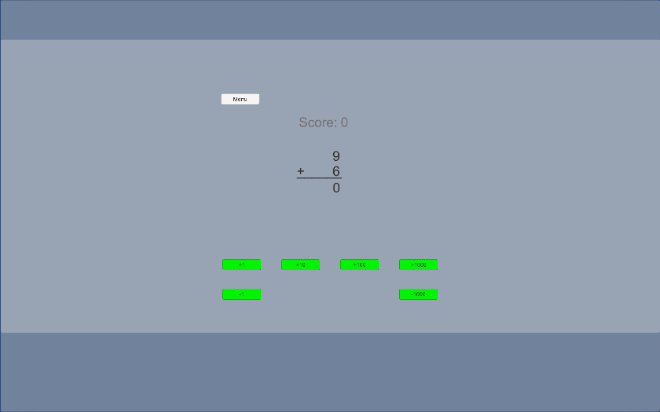

# MathUnitGame
Mobile Math Game Made in Unity

Designed to run on mobile. 
A PC compiled verison is also available <a href="https://github.com/thaoj0/MathUnitGame/raw/master/MathUnitGame.zip">here</a>.

Opening Scene:

Features: You must solver simple math problems using only the following digits.

Offers three digit level of difficulty.

